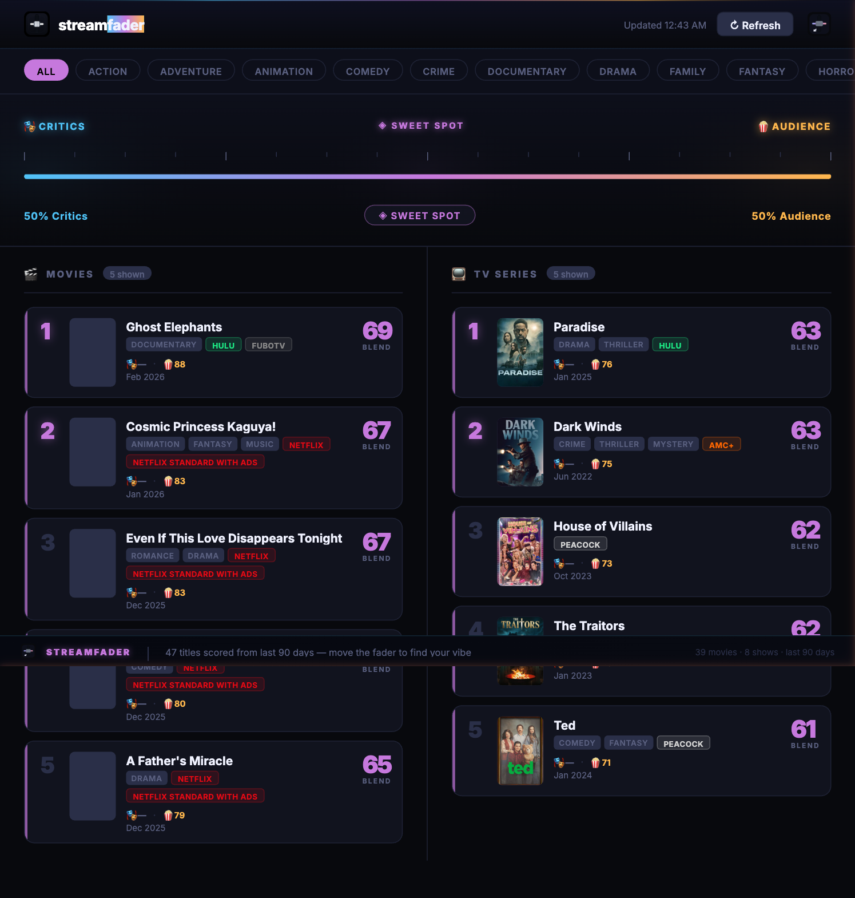

# StreamFader — Streaming Aggregator with DJ-Style Crossfader

> **The fader is the product.**



A local dashboard that ranks the best new streaming content by blending critic and audience scores through a DJ-style crossfader. Pull left for the critics. Pull right for the crowd. Find the sweet spot in the middle.

---

## What It Does

StreamFader pulls the top movies and TV shows from major streaming platforms (released in the last 90 days) and lets you score them however you want — by critic consensus, audience reaction, or any blend between the two.

Move the fader. The rankings change in real time.

---

## The Fader

```
← Critics                                     Audience →
   [RT + Metacritic avg]      [IMDB rating × 10]
          blue                      amber
                      purple
                   (sweet spot)
```

The fader blends your score: `blend = critic × (1 - fader) + audience × fader`

At the sweet spot (center), you get movies that critics and audiences both love — the ones worth your time.

---

## Data Sources

- **TMDb** (free) — streaming platform availability, movie discovery, posters
- **OMDb** (free, 1000/day) — Rotten Tomatoes %, Metacritic, IMDB scores
- **TVmaze** (free, no key) — currently airing TV show discovery
- Cache: `data/cache.json`, 6-hour TTL — no API hammering

---

## Platforms Tracked

Netflix · Prime Video · Apple TV+ · Disney+ · Hulu · Paramount+ · Max · Peacock

---

## Features

- Live fader re-ranking (no page reload)
- Genre filter pills
- Critic score (RT + MC avg) and audience score (IMDB) shown per card
- Streaming platform badges with platform colors
- Movie posters
- 90-day recency window — only what's actually new

---

## Stack

- Python + Flask, port 5556, localhost only
- No external frameworks — custom CSS, Inter font
- Color palette: critic blue `#4fc3f7` · audience amber `#ffb74d` · sweet spot purple `#c678dd`

---

## Setup

You need two free API keys:
- **TMDb**: [themoviedb.org/settings/api](https://www.themoviedb.org/settings/api)
- **OMDb**: [omdbapi.com/apikey.aspx](https://www.omdbapi.com/apikey.aspx)

```bash
git clone https://github.com/papjamzzz/stream-fader.git
cd stream-fader
cp .env.example .env
# Add your TMDB_API_KEY and OMDB_API_KEY to .env
make setup
make run
```

Then open **http://localhost:5556** in your browser.

---

## Project Structure

```
streamfader/
├── app.py              ← Flask server (port 5556)
├── engine.py           ← TMDb + OMDb + TVmaze + caching
├── templates/
│   └── index.html      ← Dashboard + fader UI
├── static/             ← Logo assets
├── data/               ← cache.json (auto-generated)
├── requirements.txt
├── launch.command      ← Mac double-click launcher
├── Makefile
└── .env.example
```

---

## License

MIT

---

*See what critics love. See what audiences love. Find what's actually worth watching.*


---

## Part of Creative Konsoles

Built by [Creative Konsoles](https://creativekonsoles.com) — tools built using thought.

**[creativekonsoles.com](https://creativekonsoles.com)** &nbsp;·&nbsp; support@creativekonsoles.com

<!-- repo maintenance: 2026-04-10 -->
